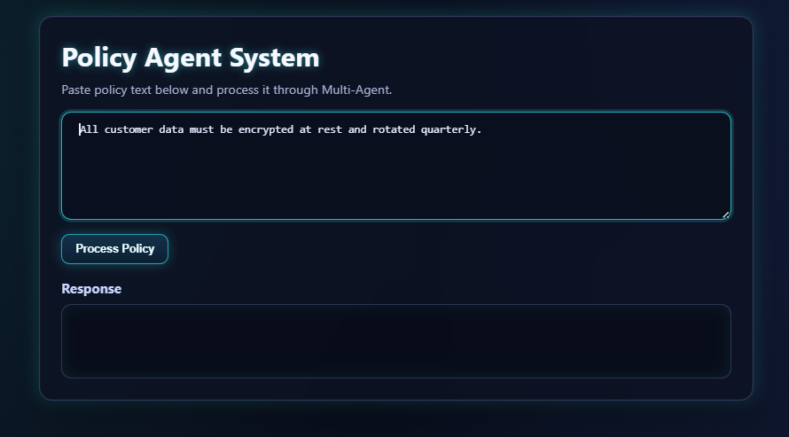
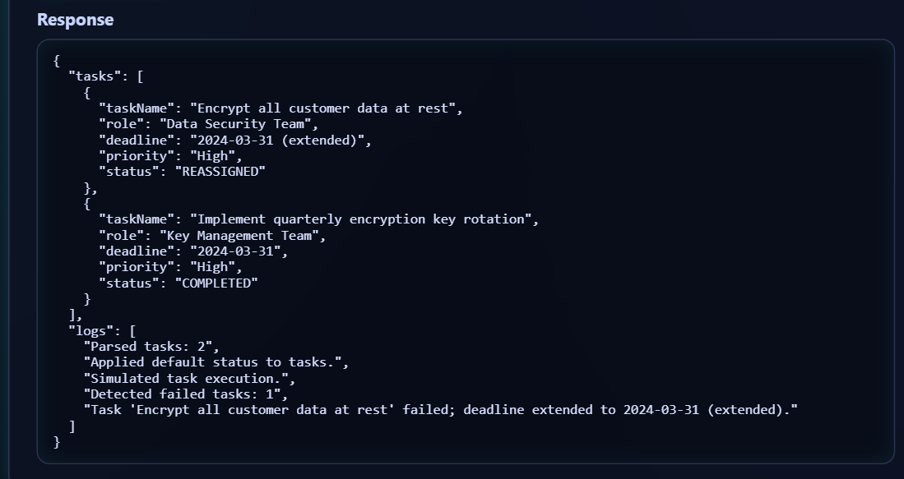

# Policy Agent System Frontend

A simple frontend interface for submitting policy text and viewing processed output from the Policy Agent backend.

## Backend Repository

Backend repo: https://github.com/sudhirskp/policy-agent-system-back

## Features

- Textarea input for policy text
- One-click policy processing
- JSON response preview
- Basic validation and error handling

## Project Structure

```text
.
├── index.html
└── images/
    ├── input.png
    └── output.png
```

## How It Works

1. Enter policy text in the input box.
2. Click **Process Policy**.
3. The frontend sends a `POST` request to:

```text
http://localhost:8080/api/process-policy
```

4. The backend response is rendered in the output panel.

## Run Frontend Locally

Since this is a static frontend, you can run it with any static server.

### Option 1: VS Code Live Server

- Open this folder in VS Code.
- Start Live Server from `index.html`.

### Option 2: Python HTTP Server

```bash
python -m http.server 5500
```

Then open:

```text
http://localhost:5500
```

## API Contract (Expected)

Frontend sends:

```json
{
  "policyText": "your policy text"
}
```

Content type:

```text
application/json
```

## Screenshots

### Policy Input



### Response Output



## Notes

- Ensure the backend is running on `http://localhost:8080`.
- If backend CORS is not configured, browser requests may fail.
